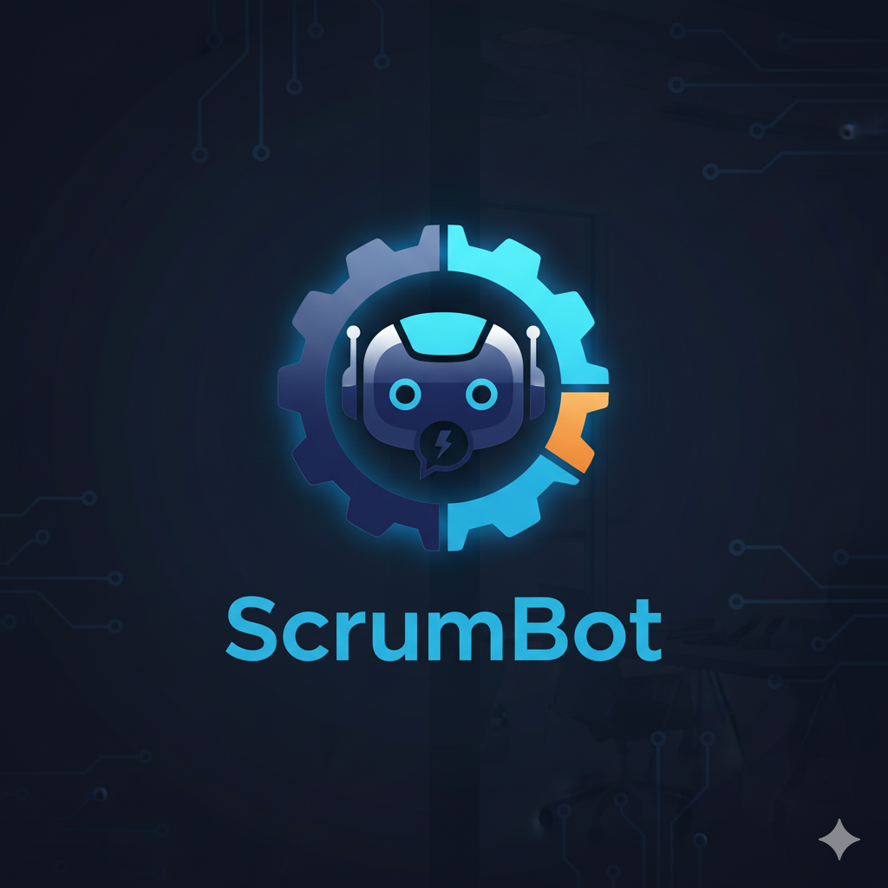

<<<<<<< HEAD

  

Checkpoint 3 github - https://github.com/omvyas2/scrumbot-dynamic
Presentation - https://uillinoisedu-my.sharepoint.com/:p:/g/personal/omvyas2_illinois_edu/Ea3ksR5NWTNIqK_KavycQsEBgzfM9KMULNKyLO-svnpr_w?e=n9I31m

# ScrumBot
Contributors - Om vyas (omvyas2@illinois.edu) & Nakul Vasani (nvasani2@illinois.edu)
## Problem statement and why it matters
Agile teams waste hours after sprint ceremonies turning loosely phrased discussion into **concrete user stories** and then deciding **who should own each story**. Ownership is often ad-hoc (who spoke loudest, who did it last time, who seems free), creating bottlenecks, uneven workload, and missed growth opportunities.  
**ScrumBot** converts meeting transcripts into structured Scrum artifacts (As a / I want / So that + Given/When/Then) and uses **retrieval-augmented generation (RAG)** over a private **team skills/experience database** to recommend owners with transparent, evidence-backed justifications. Humans stay in the loop to confirm or override.

---

## Target users and core tasks
**Users**
- Product Owners / Scrum Masters  
- Tech Leads / Engineering Managers  
- Project Managers in Agile teams

**Core tasks**
1) **Upload** a transcript (.vtt/.srt/.txt).  
2) **Extract** structured items: user stories, acceptance criteria, risks, action items (each with quotes + timestamps).  
3) **Assign** owners via RAG over team specifications (skills, history, capacity, goals)
4) **Review & edit** fields inline; mark “needs clarification” when evidence is missing.  
5) **Export** Meeting action notes with assigned user stories.

---

## Competitive landscape: existing systems/tools and their shortcomings
- **Generic meeting AI** (Zoom/Meet companion, Otter): good summaries, but **not Scrum-aware**, no owner recommendations, and little evidence traceability.  
- **Jira/GitHub automations**: can templatize issues; **no skill/capacity reasoning**, usually manual assignee selection.  
- **Research prototypes** (meeting summarization, action-item extraction): improve salience but rarely deliver **Jira-ready artifacts** or **assignment logic** tied to team data.  
**What we add:** Scrum-specific structure, **timestamped evidence** for every field, and **owner recommendations** grounded in a **local** team knowledge base.

---

## Initial concept and value proposition
**Concept:** Local-first web app that turns transcripts into **evidence-grounded** Scrum stories and recommends owners using **RAG + multi-factor scoring** (competence, availability, fairness/growth, continuity).

**Value**
- **Time saved:** Meeting → tickets in minutes, not hours.  
- **Higher quality stories:** Enforced As a/I want/So that + GWT with citations.  
- **Transparent assignment:** Ranked owners with “why” (skills matched, similar past stories, capacity).  
- **Fairness & growth:** Balance workload and create learning opportunities by design.  
- **Privacy:** Team data and transcripts remain **local** by default.

**High-level flow**
1) Parse transcript → segments with timestamps/speakers.  
2) Extract stories/actions(quotes + timestamps).  
3) Build RAG index over **member cards** (skills, history, capacity, preferences).  
4) Score candidates per story (α competence, β availability, γ fairness/growth, δ continuity).  
5) UI for edits → **Export** Jira CSV / Markdown.

---

## Milestones & roles (who owns what)

### Checkpoint 1 — Problem framing & setup (Week 1–2)
- Deliverables: README, proposal, /literature (≥8 papers), repo scaffold, 2 sample transcripts, team KB schema.

### Checkpoint 2 — Prompt & RAG validation (Week 3–4)
- Deliverables: notebooks testing **extraction** and **assignment** (RAG over member cards); small gold set + pilot metrics.

### Checkpoint 3 — Working demo (Week 5–7)
- Deliverables: app — upload → stories with evidence → ranked owners → inline edits → Jira CSV + Markdown export.

### Checkpoint 4 — Evaluation & presentation (Week 8–10)
- Deliverables: Metrics (story extraction F1, owner suggestion acceptance rate, time saved, fairness distribution), ablations (with/without evidence), final slides + live demo, reflections.

---
=======
# ScrumBot - AI-Powered Sprint Planning Assistant

ScrumBot converts meeting transcripts into structured Scrum artifacts and uses AI to recommend optimal story owners based on team skills, capacity, and preferences.

## Features

- **Transcript Parsing**: Upload `.srt`, `.vtt`, or `.txt` meeting transcripts
- **AI Story Extraction**: Automatically extracts user stories in "As a / I want / So that" format with evidence
- **RAG-Based Owner Assignment**: Uses retrieval-augmented generation to recommend owners based on:
  - Competence (skills & experience match)
  - Availability (current capacity)
  - Growth Potential (learning opportunities)
  - Continuity (previous similar work)
- **Interactive Review**: Edit stories, adjust weights, and override assignments
- **CSV Export**: Export to Jira-compatible CSV format

## Setup

1. **Install dependencies**:
   \`\`\`bash
   npm install
   \`\`\`

2. **Set up environment variables**:
   The Groq API key is already configured in `environment.env`. If you need to change it, update:
   \`\`\`
   GROQ_API_KEY=your_groq_api_key_here
   \`\`\`

3. **Run the development server**:
   \`\`\`bash
   npm run dev
   \`\`\`

4. **Open the app**:
   Navigate to [http://localhost:3000](http://localhost:3000)

## Usage

1. **Upload Transcript**: Drag and drop or paste your meeting transcript
2. **Load Team Data**: Click "Load Demo Data" or configure your team
3. **Adjust Weights**: Tune the importance of competence, availability, growth, and continuity
4. **Process**: Click "Process Transcript" to extract stories and generate recommendations
5. **Review**: Edit stories, view suggestions, and assign owners
6. **Export**: Lock the sprint and export to CSV for Jira import

## Technology Stack

- **Frontend**: Next.js 15, React, TypeScript, Tailwind CSS
- **AI**: Groq (Llama 3.3 70B), Vercel AI SDK
- **State Management**: Zustand
- **UI Components**: shadcn/ui

## Project Structure

\`\`\`
├── app/
│   ├── page.tsx              # Landing page (upload & configure)
│   ├── loading/page.tsx      # Processing page
│   ├── review/page.tsx       # Story review & assignment
│   ├── lock/page.tsx         # Final review & export
│   └── api/
│       ├── extract-stories/  # AI story extraction endpoint
│       └── rank-owners/      # RAG-based ranking endpoint
├── lib/
│   ├── aiRank.ts            # AI-powered ranking logic
│   ├── mockRank.ts          # Fallback ranking algorithm
│   ├── parseTranscript.ts   # Transcript parsing
│   ├── csv.ts               # CSV export
│   └── store.ts             # Zustand state management
├── components/
│   ├── story-card.tsx       # Story editing component
│   ├── weight-tuner.tsx     # Weight adjustment UI
│   └── workload-summary.tsx # Team capacity visualization
└── types.ts                 # TypeScript type definitions
\`\`\`

## Contributors

- Om Vyas (omvyas2@illinois.edu)
- Nakul Vasani (nvasani2@illinois.edu)

## License

MIT
>>>>>>> 53d3431 (Initialized repository for chat Remix of Duplicate of Remix of Untitled)
